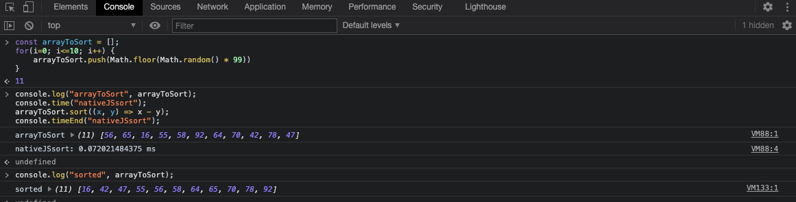
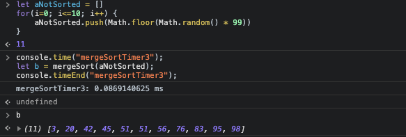
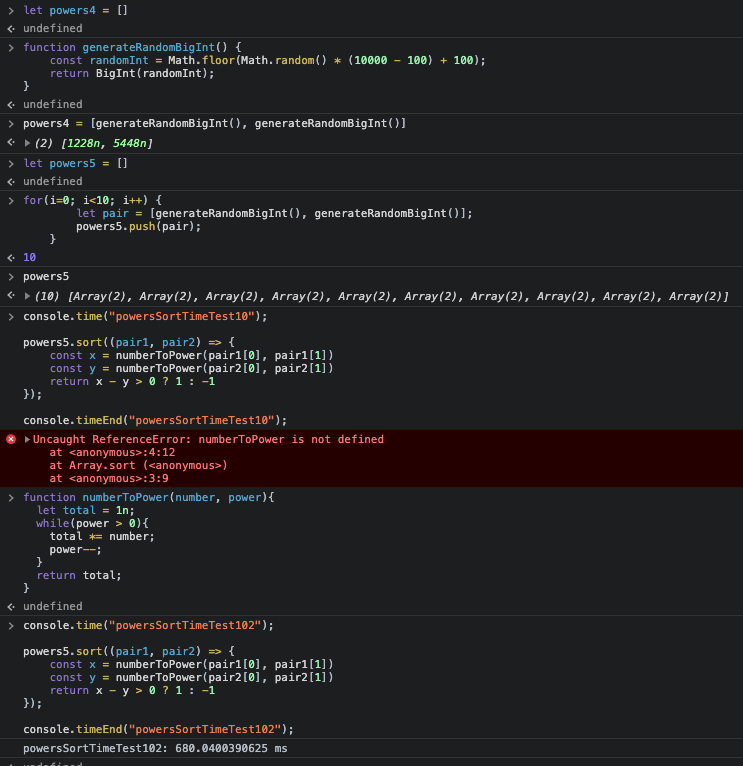
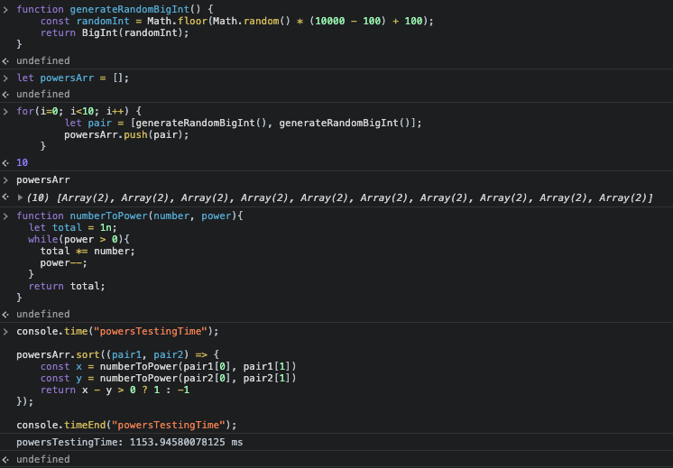

# Basic CS

## A) Write a function that sorts 11 small numbers (<100) as fast as possible. Estimate how long it would take to execute that function 10 Billion (10^10) times on a normal machine?

---

In order to determine which function (really) sorts array of those kind of numbers as fast as possible, I tried with javascript native "sort" function and "merge sort" algorithm.

### Native JS **sort** function

```js
function generate11ElRandomArr() {
	let randomArr = [];
	for(i=0; i<=10; i++) {
		randomArr.push(Math.floor(Math.random() * 99))
	}
	return randomArr;
}

let arrayToSort = generate11ElRandomArr();

console.time("nativeJSsort");
// native js sort function for arrays of numbers
arrayToSort.sort((x, y) => x - y);
console.timeEnd("nativeJSsort");
```
*Execution time attached in image below* (~ 0.072 ms)


### Merge Sort function

```js
function merge(left, right) {
    let mergeArray = [];
    // compare elements from "left" and "right" array as long as there are any left
    while (left.length && right.length) {
        if (left[0] < right[0]) {
            mergeArray.push(left.shift());  
        } else {
            mergeArray.push(right.shift()); 
        }
    }
    // in case that "left" and "right" array does not have same length
    // merge leftover element(s)
    return [ ...mergeArray, ...left, ...right ];
}

function mergeSort(array) {
  const half = array.length / 2;
  // if there is only one element in an array or no elements - no sort needed
  if(array.length < 2){
    return array; 
  }
  
  const left = array.splice(0, half);
  // keep dividing array until there are only single elements arrays left
  // if case of odd number of elements, the left one gets smaller number of elements
  return merge(mergeSort(left),mergeSort(array));
}

let aNotSorted = generate11ElRandomArr();
let b = [];

console.time("mergeSort");
// mergeSort
b = mergeSort(aNotSorted);
console.timeEnd("mergeSort");
```
*Execution time attached in image below* (~ 0.0869 ms)


### Conclusion A)
Merge Sort algorithm has time complexity of *O(n log n)*, while native JS *sort()+ function implements "in-place" algorithm (time complexity <a href="https://developer.mozilla.org/en-US/docs/Web/JavaScript/Reference/Global_Objects/Array/sort" target="_blank">can not be guaranteed and depends on implementation.</a>)

Estimation of sort() function on randomly generated arrays of numbers 10 Billion times - time needed should nevertheless be less than *10Billion * 0,072ms = 200h*, since this time could largeley decrease with use of **memoization** (*) while looping through and sorting these arrays.

(*) Every array that is sorted is stored with its sorted value by its unsorted key, so when next time in 10 Billion loop when/if same array needs sorting, we could reuse already sorted(saved) array instead of computing same sort() function on same array and in that way save on computing time.

---

## B) Write a function that sorts 10000 powers (a^b) where a and b are random numbers between 100 and 10000? Estimate how long it would take on your machine?

```js
let powers = [];

// function for generation random integer number between 100 and 10000
function generateRandomBigInt() {
	const randomInt = Math.floor(Math.random() * (10000 - 100) + 100);
	return BigInt(randomInt);
}

// function for generation 10000 pairs --> [a, b] as an input for generation (a^b) --> as future element of a "powers" array that needs to be sorted
function generateTenThousandsPowersPairs() {
    for(i=0; i<10000; i++) {
        let pair = [generateRandomBigInt(), generateRandomBigInt()];
        powers.push(pair);
    }
    return powers;	
}

// function for calculation (a^b)
// BigInt notation has been used because (a^b) (where "a" and "b" are random numbers between 100 and 10000) possibly results in a number that exceeds maximum safe integer value span *(-(2^53 - 1) and 2^53 - 1)*
function numberToPower(number, power){
  let total = 1n;
  while(power > 0){
    total *= number;
    power--;
  }
  return total;
}

generateTenThousandsPowersPairs();

console.time("powersTestingTime");

powers.sort((pair1, pair2) => {
	const x = numberToPower(pair1[0], pair1[1])
	const y = numberToPower(pair2[0], pair2[1])
	return x - y > 0 ? 1 : -1
});

console.timeEnd("powersTestingTime");
```
### Conclusion B)

Generating and sorting of 10 elements array (with array elements (a^b)), on <a href="https://support.apple.com/kb/sp715?locale=en_US" target="_blank">my machine</a> takes between ~ *680.04 ms* and ~ *1153.94 ms* (**), which would imply that for 10000 elements array of this type, operation would take between ~ *680.04 s* *(~ *11.33 min*) and ~ *1153.94 s* *(~ *19.23 min*).

(**) *Since the array is randomly generated, estimated execution time will highly depend on elements in an array and time needed to compute numberToPower(a, b) function - it will last more and more when "b" is bigger.*

*Execution times attached in images below* (~680.04 ms)
<br>
